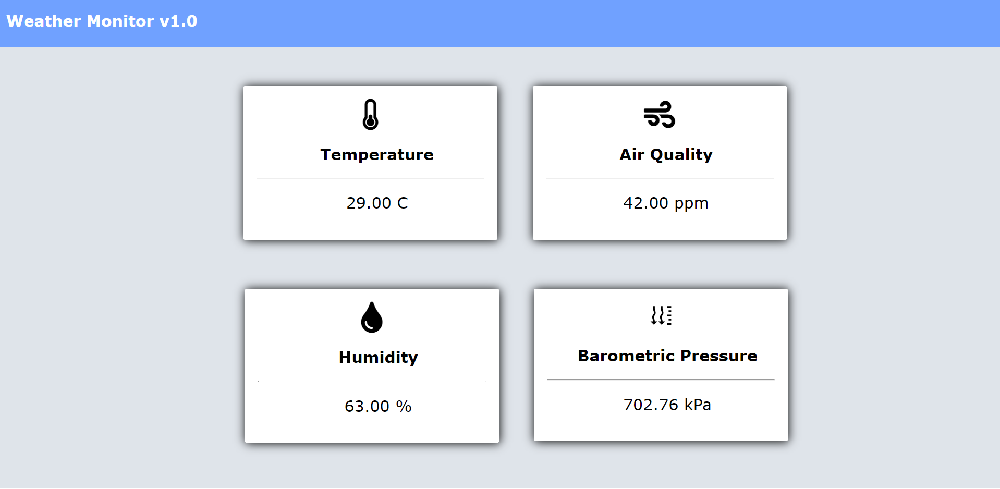
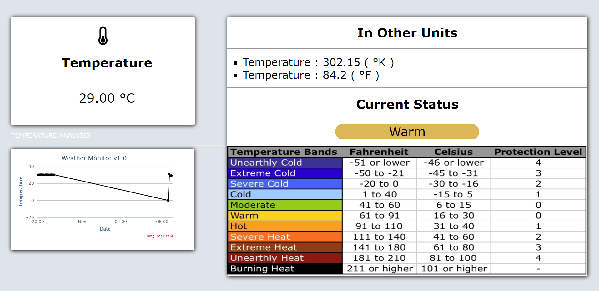
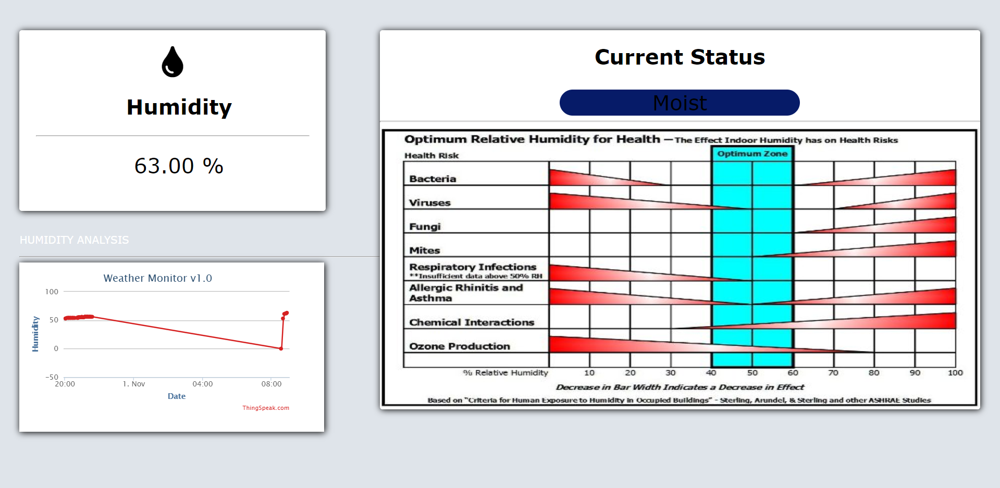
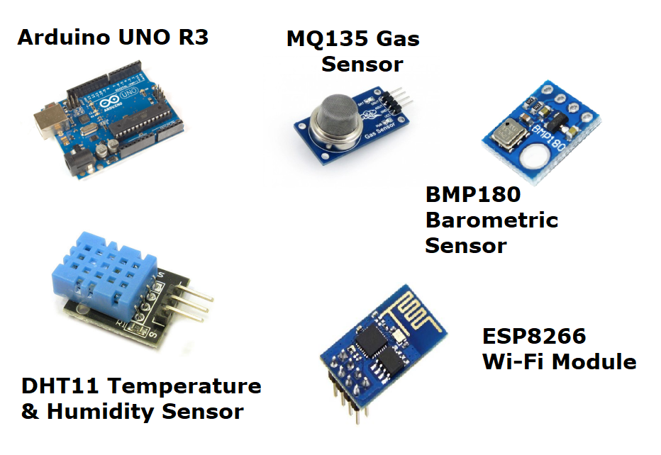

<h3>Simple Weather Monitor v1.0 </h3>

This is a simple weather monitoring system using Arduino UNO R3
 
+ Records Temperature & Humidity 
+ Records Pressure 
+ Records Concentration of CO2 
<h3> Preview </h3>

<h3> Technologies Used </h3>
<ul type="square">
   <li> HTML </li>
  <li> CSS </li>
  <li> JavaScript </li>
  <li> Arduino UNO IDE:- </li>
  <a href="https://www.arduino.cc/en/Main/Software"> Click here to get Arduino IDE </a>
  <li> Thingspeak Analytics </li>
  <a href="https://thingspeak.com/"> Click here to register on thingspeak </a>
  </ul>
<h3> Conceptual Working </h3>

<h3> Components Required </h3>

